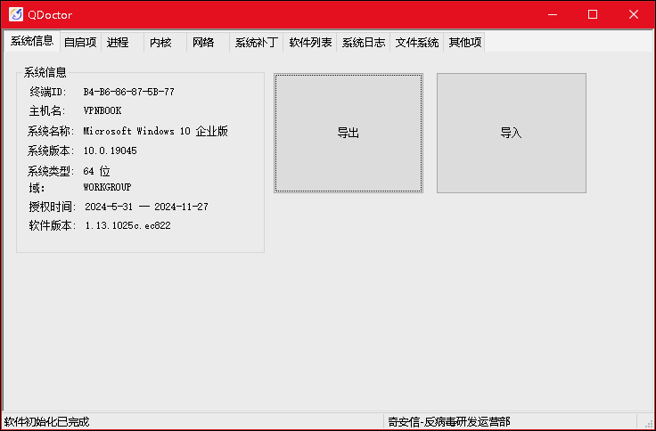
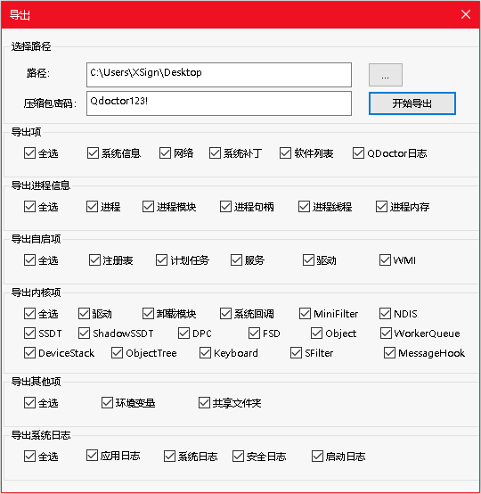
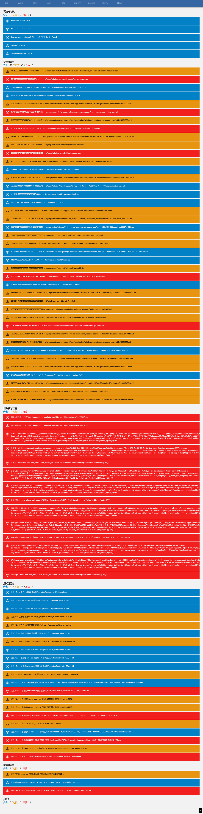
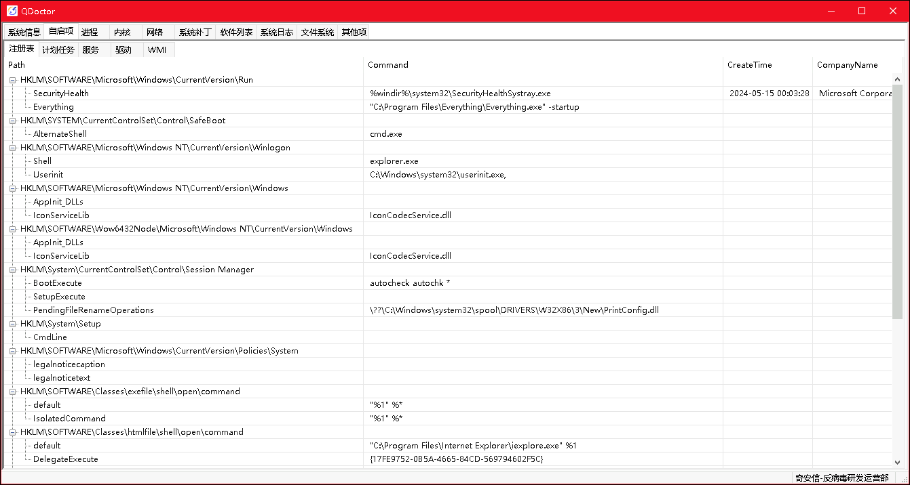
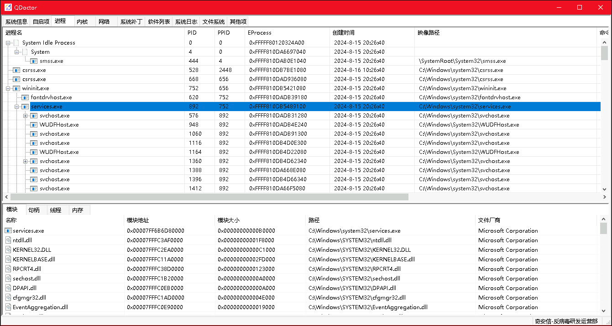
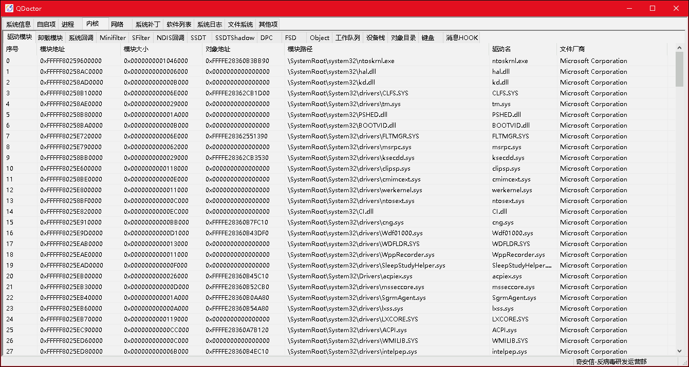
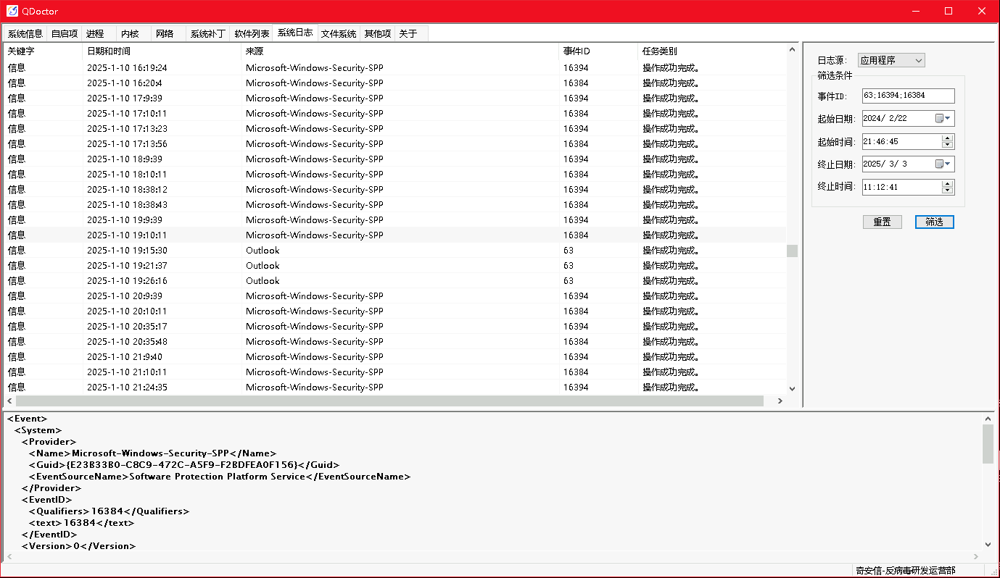
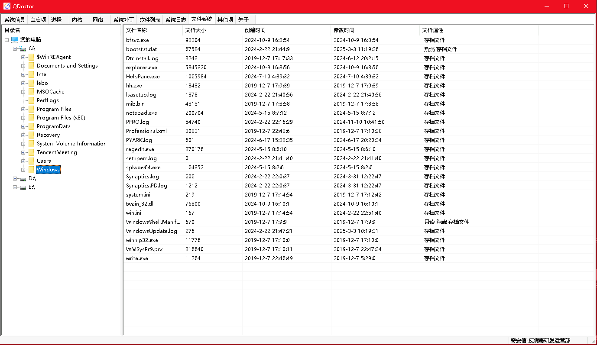

    <picture>
        <source srcset="./image/banner-light.png" media="(prefers-color-scheme: light)" />
        <source srcset="./image/banner-dark.png"  media="(prefers-color-scheme: dark)" />
        
    </picture>

年轻人的第一款应急响应工具 ；)

<a href="https://github.com/QAX-Anti-Virus/QDoctor/blob/master/README.EN.md">English Version Document</a>

# 简介

QDoctor(下文中简称QD)是一款非传统意义上的ARK(Anti RootKit)工具。

QD既覆盖了传统ARK工具的功能，同时又兼顾了应急响应过程中的常见需求。使用此工具可以极大的提高应急处置的效率、快速定位目标环境中潜在的恶意项目所在位置。

QD的日志导出功能可以让普通用户轻松且全面的提取系统各种信息，导入功能则可以让专业人员可以全面掌握导出该日志主机的各项情况进而快速定位系统中的猫腻。

如果您手头有威胁情报资源，结合QD导出的结构化日志，可以搭建一套自动化威胁分析系统（另外一种形态的沙箱）。

    

    <a href="https://github.com/QAX-Anti-Virus/QDoctor/releases/download/latest/QDoctor.exe">下载地址</a>

# 特色功能

1. 一键导出各个标签页下的结构化数据(包括涉及文件的哈希值)。
2. 一键导入由其他机器导出的数据，方便排查问题。
3. 单文件同时支持X86、X86_64系统，系统支持较为全面。
4. 对部分有对抗性的样本具备穿透能力。

    

# 功能

除去上述特色功能外，此工具还有传统的ARK工具常见功能，如下：

* **基本系统信息**：系统MAC地址、系统版本等信息。
* **自启动项目**：注册表常见启动项、计划任务、服务、驱动、WMI。
* **进程**：查看进程、线程、模块、内存、句柄、内核回调； 暂停进程或线程执行、查杀进程或线程、卸载模块或内存、关闭句柄、签名验证、Hook扫描。
* **内核**：驱动模块、已卸载模块、系统回调函数、微过滤驱动、Sfilter过滤驱动、NDIS回调、SSDT表、ShadowSSDT表、DPC定时器、FSD驱动、对象信息、内核工作队列、设备栈、对象目录、键盘驱动、消息钩子。
* **网络**：查看各个进程的网络连接情况，支持IPv4&IPv6的TCP&UDP连接。
* **系统补丁**：查看当前系统安装的补丁状况。
* **软件列表**：查看当前系统安装的软件列表，内容等价于系统“添加删除程序”中显示的内容。
* **系统日志**：应用程序日志、安全日志、Setup日志、系统日志。
* **文件系统**：简易文件管理器，可以查看系统各个盘（包括映射到本地的网络位置）下的内容以及强制删除文件。
* **其他**：环境变量、共享文件夹信息。

# 支持系统

* Windows 7   x86 x86_64
* Windows 8   x86 x86_64
* Windows 8.1 x86 x86_64
* Windows 10  x86 x86_64
* Windows 11      x86_64
* Windows Server 2008 R2 x86_64
* Windows Server 2012    x86_64
* Windows Server 2012 R2 x86_64
* Windows Server 2016    x86_64
* Windows Server 2019    x86_64
* Windows Server 2022    x86_64

#### 说明：

0. **由于ARK工具的特殊性，任何使用场景都有蓝屏风险，请注意保存数据**, 我们对该工具造成的数据丢失不承担相关责任。
1. 由于微软已经停发sha1签名，因此Windows 7、Windows 8系统上，请打对应签名补丁或直接禁用驱动签名认证，否则程序初始化会提示失败，具体细节请参考[此文章](https://support.microsoft.com/zh-cn/topic/%E9%92%88%E5%AF%B9-windows-%E5%92%8C-wsus-%E7%9A%84-2019-sha-2-%E4%BB%A3%E7%A0%81%E7%AD%BE%E5%90%8D%E6%94%AF%E6%8C%81%E8%A6%81%E6%B1%82-64d1c82d-31ee-c273-3930-69a4cde8e64f)
2. 由于从Windows 10开始，微软使用滚动更新，因此最新版本的系统可能未及时适配。
3. 该工具为我们日常因工作需求所发展的一套“副产品”，由于所有开发人员均为反病毒人员，因此工具界面比较简陋 T.T
4. 关于授权有效期的问题：本质上是为了限制黑产，根据我们日常实践经验当前3个月有效期不会对应急有严重影响。如果您有特别的需求，欢迎跟我们的商务进行联系。
5. 该程序启动后会发起一次到github的更新检查请求，请求的ip地址大概率不位于中国境内，可能会导致防火墙告警。
6. 该程序被安全软件查杀（包括我司）属于预期内现象，请确认签名完整有效后添加白名单使用。

# Bug反馈

本工具官方反馈地址为:

[https://github.com/QAX-Anti-Virus/QDoctor/issues](https://github.com/QAX-Anti-Virus/QDoctor/issues)

您可能会在各个论坛看到此文档，但是我们的“运营”人员不一定会关注当前论坛，请务必在上述地址反馈问题。

# 已知问题

1. 内存完整性校验(内核隔离)会导致驱动加载失败，目前暂未解决，如果驱动加载失败请关闭该功能并重启系统后重试。
2. Inline Hook检测引擎目前对超短函数检测还有问题。
3. 遍历某些数据时耗时较长(非必现)。
4. 在Preview版本的系统上某些功能可能获取不到数据。
5. 目前版本不支持网络路径，例如\\\\192.168.1.1\\QDoctor.exe，请避免在网络路径上直接运行此程序。

# One more thing

上面提到，此工具可以一键导出结构化后的各标签页数据。因此，如果你手头有相关资源，完全可以根据需求搭建一套威胁分析系统。

下图展示了我们内部利用威胁情报能力发展的一套快速分析系统，安服人员可以将该工具导出的压缩包上传到这套系统快速发现威胁点：

    

**注意**： 本工具不包含上图系统，该系统具体信息请通过文末《授权》一节的联系方式向我们咨询。

# 截图（仅部分功能）

    

    

    

    

    

# 授权

本工具出于个人用途可在授权时段内免费使用，商业用途请联系我司取得授权，禁止使用本工具从事违反中华人民共和国以及当地法律的犯罪活动。

* [提交项目咨询](https://www.qianxin.com/about/advisory)
* 客服邮箱：kefu@qianxin.com
