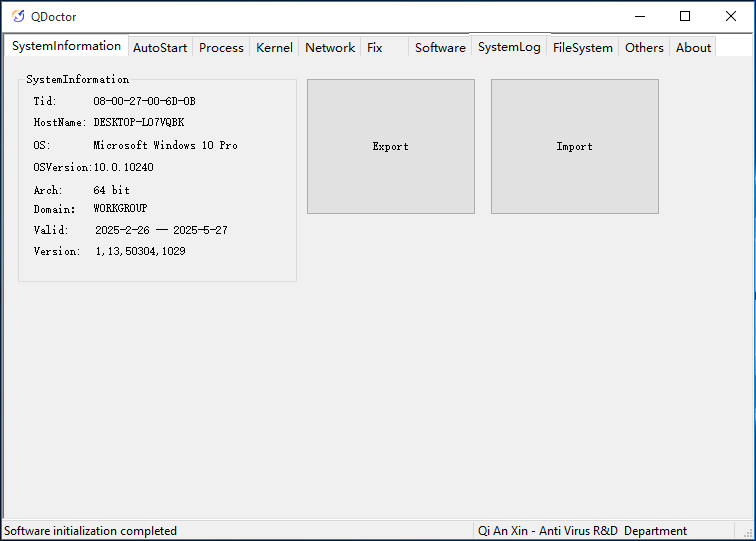
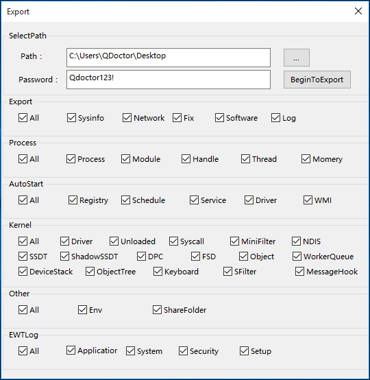
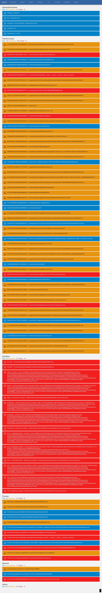
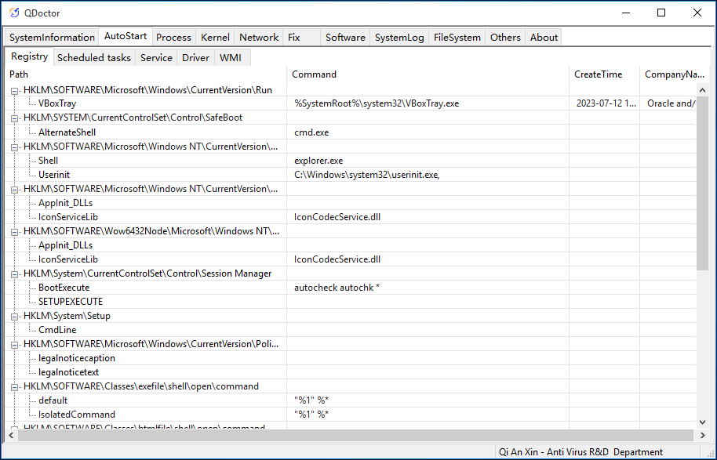
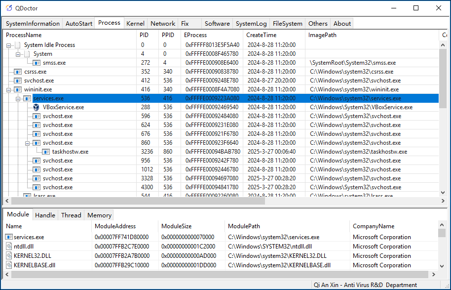
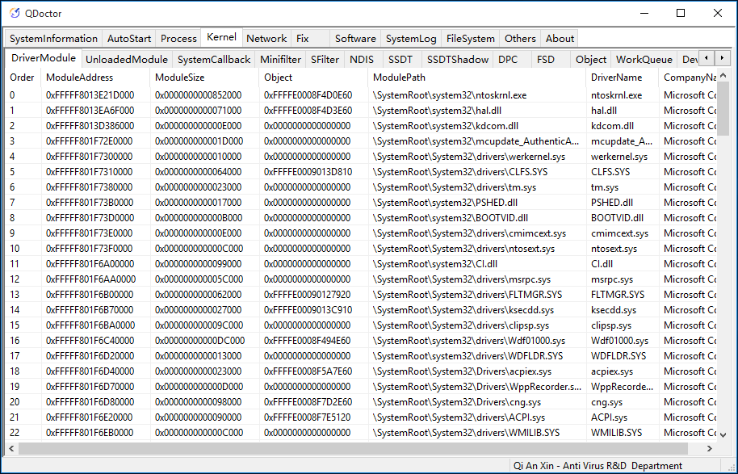
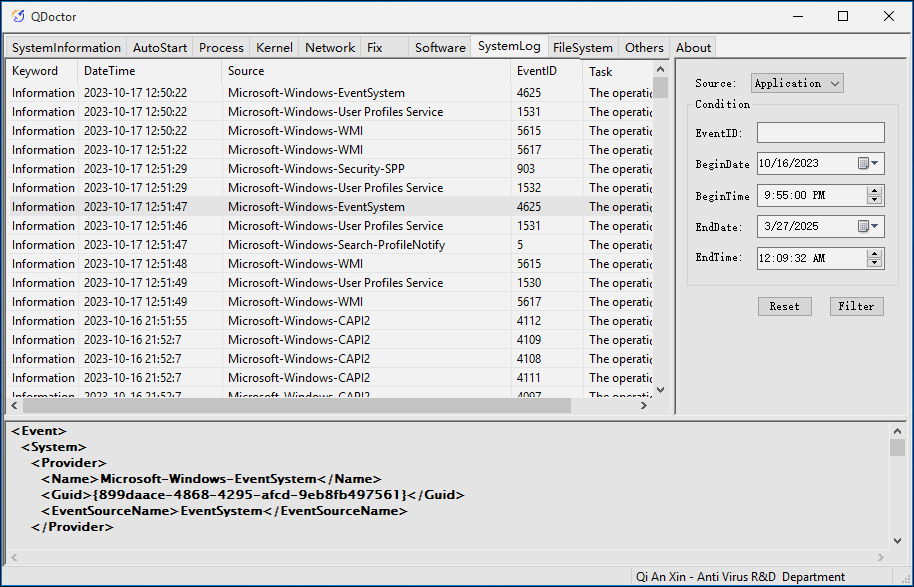
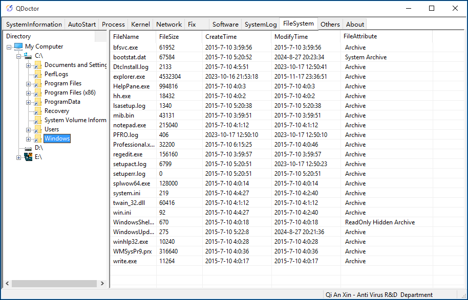


    


Young People's First Emergency Response Tool ;)

[中文版文档](https://github.com/QAX-Anti-Virus/QDoctor/blob/master/README.md)


# Introduction

QDoctor (referred as QD below) is an unconventional ARK (Anti RootKit) tool.

QD not only covers the functionalities of traditional ARK tools but also meets common requirements during the emergency response process. Using this tool can greatly improve the efficiency of emergency handling and quickly locate potential malicious items in the target environment.

The log export ability of QD allows ordinary users to easily and comprehensively extract various system information, while the import ability enables professionals to fully understand the conditions of the host from which the logs were exported, thus rapidly identifying suspicious activities within the system.

If you have threat intelligence resources at hand, combined with the structured logs exported by QD, you can build an automated threat analysis system (another form of sandbox).


    



    [DOWNLOAD](https://github.com/QAX-Anti-Virus/QDoctor/releases/download/latest/QDoctor.exe)


# Special Features

1. Export structured data of information under each tab (including hash values of relevant files) with one-click.
2. Import exported data from other machines with one-click for convenient troubleshooting.
3. Single file with supports both X86 and X86_64 architecture.
4. Capable of penetrating some samples with resistance capabilities.


    


# Features

Apart from the above features, this tool also includes common functions found in traditional ARK tools, such as:

* **Basic system information**: System MAC address, system version, etc.
* **Startup items**: Common startup items in the registry, scheduled tasks, services, drivers, WMI.
* **Processes**: View processes, threads, modules, memory, handles, kernel callbacks; pause process or thread execution, terminate processes or threads, unload modules or memory, close handles, signature verification, Hook scanning.
* **Kernel**: Driver modules, unloaded modules, system callback functions, minifilter drivers, Sfilter drivers, NDIS callbacks, SSDT table, ShadowSSDT table, DPC timers, FSD drivers, object information, kernel work queues, device stacks, object directories, keyboard drivers, message hooks.
* **Network**: View network connection status of each process, supporting IPv4&IPv6 TCP&UDP connections.
* **System patches**: View current system patch status.
* **Software list**: View installed software list on the current system equivalent to what is displayed in "Add or Remove Programs" in system control panel.
* **System logs**: Application logs, security logs, Setup logs, system logs.
* **File system**: Simple file manager that can view contents of system drives (including mapped network locations) and forcibly delete files.
* **Others**: Environment variables, shared folder information.

# Supported Systems

* Windows 7   x86 x86_64
* Windows 8   x86 x86_64
* Windows 8.1 x86 x86_64
* Windows 10  x86 x86_64
* Windows 11      x86_64
* Windows Server 2008 R2 x86_64
* Windows Server 2012    x86_64
* Windows Server 2012 R2 x86_64
* Windows Server 2016    x86_64
* Windows Server 2019    x86_64
* Windows Server 2022    x86_64

#### Note:

0. **Due to the specificity of ARK tools, there is a risk of blue screen in any usage scenario**, please make sure to save your data. We do not assume responsibility for any data loss caused by using this tool.
1. As Microsoft has ceased issuing SHA-1 signatures, on Windows 7 and Windows 8 systems, please apply the corresponding signature patch or directly disable driver signature verification; otherwise, the program initialization will fail. For more details, refer to [this article](https://support.microsoft.com/en-us/topic/2019-sha-2-code-signing-support-requirement-for-windows-and-wsus-64d1c82d-31ee-c273-3930-69a4cde8e64f).
2. Since Windows 10, Microsoft has adopted rolling updates, hence the latest system versions may not be promptly adapted.
3. This tool is a byproduct developed out of our daily work requirements. Given that all developers are antivirus professionals, the tool's interface is relatively simple T.T.
4. Regarding the issue of authorization validity period: It is essentially aimed at restricting illegal activities of blackhat hackers. Based on our practical experience, a current validity period of three months does not significantly impact emergency response scenarios. If you have specific needs, feel free to contact our business team.
5. It is expected for this program to be flagged by security software (including ours). Please ensure the signature is complete and valid before adding it to the whitelist for use.

# Bug Reporting

Official feedback address for this tool:

[https://github.com/QAX-Anti-Virus/QDoctor/issues](https://github.com/QAX-Anti-Virus/QDoctor/issues)

You may come across this document on various places, but our people may not necessarily monitor the "current place". Please be sure to report any issues at the address provided above.

# Known Issues

1. Memory integrity checks (kernel isolation) can cause driver loading failures. This issue has not yet been resolved. If the driver fails to load, please disable this feature and restart the system before trying again.
2. The Inline Hook detection engine currently has issues detecting ultra-short functions.
3. Traversing certain data may take a long time (not always reproducible).
4. Some functions may fail to retrieve data on Preview versions of Windows.
5. The current version does not support network paths, such as \\192.168.1.1\QDoctor.exe. Please avoid running this program directly from a network path.

# One more thing

As mentioned above, this tool can export structured data from all tabs with a single click. Therefore, if you have relevant resources, you can build a threat analysis system tailored to your needs.

The image below demonstrates a rapid analysis system we developed internally by leveraging threat intelligence capabilities. Security service personnel can upload the compressed package exported by this tool to the system to quickly identify threat points:


    


**Note**: The system shown in the image is not included with this tool. For more information about the system, please contact us using the details provided in the "LICENSE" section at the end of this document.

# Screenshots (Partial Features Only)


    



    



    



    



    


# LICENSE

This tool is free to use for personal purposes within the authorized time period. For commercial use, please contact our company to obtain authorization. It is prohibited to use this tool for criminal activities that violate the laws of the People's Republic of China and local regulations.

* [Submit Project Inquiry](https://en.qianxin.com/about/contactus)
* Customer Service Email: GlobalPartner@qianxin.com

